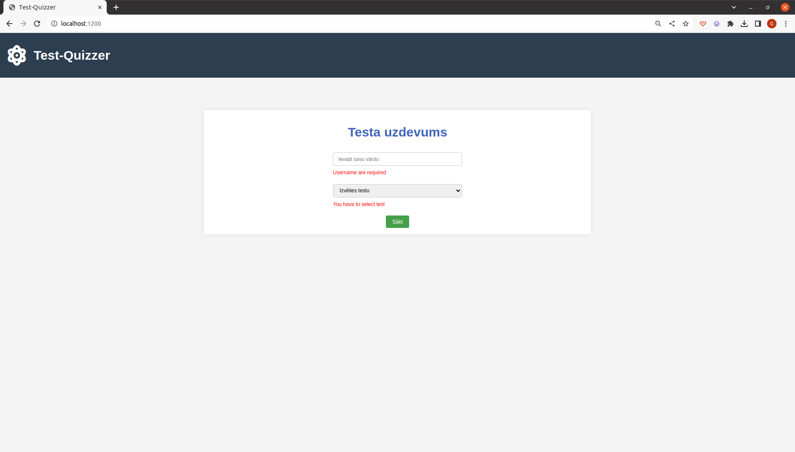

# Test-Quizzer 📝

Welcome to **Test-Quizzer**! This is a dynamic quiz application designed to provide users with a unique test-taking experience. Dive in to check your knowledge on a variety of topics or simply enjoy the interactive quiz experience.

## Features 🌟

- **Dynamic Question and Option Generation**: Adjusts according to the user's preference.
- **Real-time Progress Tracking**: An elegant progress bar to show your test progress.
- **Immediate Feedback**: Get to know how you performed right after the test.
- **Responsive Design**: Made for both mobile and desktop screens.

## Preview GIFs 🎥

### General Workflow


### Mobile Experience


### Screenshots





## 🚀 Setting up Test-Quizzer

### Follow these steps to get the project up and running smoothly:

#### 1. 📦 Clone the Repository

```bash
   git clone https://github.com/Guntars123/quiz-page.git
```

Navigate to the project directory:

```bash
   cd quiz-page
```

#### 2. 🧪 Install Dependencies

Install all the necessary dependencies using Composer:

```bash
   composer install
```

#### 3. 🔧 Configure Environment

Rename the .env.example file to .env:

```bash
mv .env.example .env
```

Open the .env file and configure the database connection details:

```bash
DB_HOST=your_database_host
DB_NAME=your_database_name
DB_USER=your_database_user
DB_PASS=your_database_password
```

Replace the placeholders (your_database_host, your_database_name, etc.) with your actual database connection details.

#### 4. 🌍 Start the Development Server

Navigate to the /public directory:

```bash
cd public
```

Start the development server:

```bash
php -S localhost:8000
```

#### 5. 💻 Access Test-Quizzer

Now, you should be able to access the application by visiting http://localhost:8000 in your web browser. Enjoy exploring Test-Quizzer!

That's it! You've successfully set up and launched Test-Quizzer on your local machine. Happy quizzing!